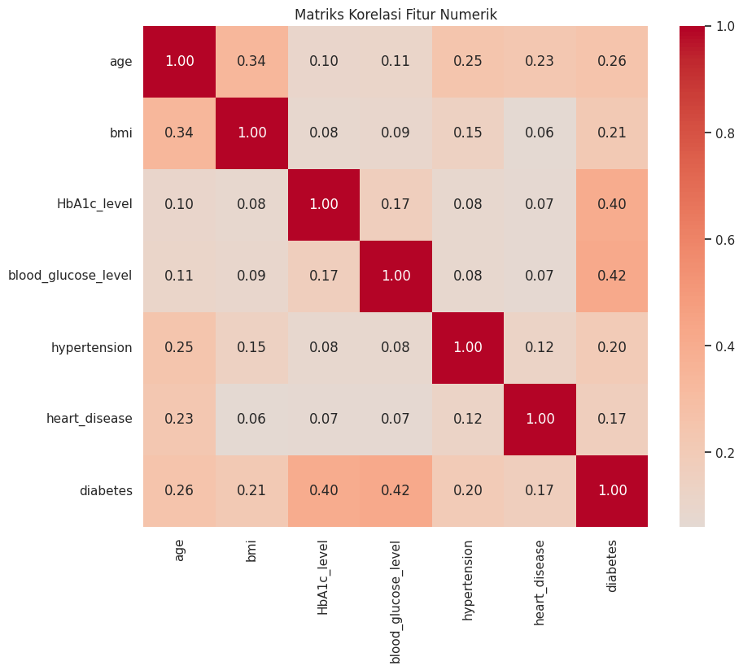

# Laporan Proyek Machine Learning - Muhamad Hamzah

## Domain Proyek

Diabetes merupakan penyakit kronis yang ditandai dengan tingginya kadar gula darah. World Health Organization (WHO) melaporkan bahwa jumlah penderita diabetes meningkat secara signifikan dari 108 juta pada tahun 1980 menjadi 422 juta pada tahun 2014 [1]. Di Indonesia sendiri, menurut data Riset Kesehatan Dasar (Riskesdas) tahun 2018, prevalensi diabetes pada penduduk umur ≥15 tahun mengalami peningkatan dari 6,9% pada tahun 2013 menjadi 8,5% pada tahun 2018 [2].

Deteksi dini diabetes sangat penting karena komplikasi yang dapat ditimbulkan seperti penyakit jantung, kebutaan, gagal ginjal, dan amputasi ekstremitas bawah. Diagnosis dini memungkinkan pasien untuk melakukan perubahan gaya hidup dan mendapatkan pengobatan yang tepat sebelum komplikasi serius terjadi. Oleh karena itu, pengembangan model prediktif yang dapat mengidentifikasi individu berisiko tinggi diabetes sangat diperlukan dalam upaya pencegahan dan manajemen penyakit ini.

Penggunaan machine learning untuk prediksi diabetes memiliki beberapa keunggulan dibandingkan metode konvensional, antara lain kemampuan untuk menganalisis data dalam jumlah besar dengan berbagai variabel serta dapat mengidentifikasi pola yang mungkin terlewatkan oleh manusia. Beberapa penelitian terdahulu telah menunjukkan hasil yang menjanjikan dalam penggunaan algoritma machine learning untuk prediksi diabetes, seperti penelitian oleh Sisodia dan Sisodia (2018) yang mencapai akurasi 76,30% menggunakan algoritma Naive Bayes [3].

**Referensi:**
1. World Health Organization. (2021). Diabetes. https://www.who.int/news-room/fact-sheets/detail/diabetes
2. Kementerian Kesehatan RI. (2018). Laporan Nasional Riskesdas 2018. Jakarta: Badan Penelitian dan Pengembangan Kesehatan.
3. Sisodia, D., & Sisodia, D. S. (2018). Prediction of diabetes using classification algorithms. Procedia Computer Science, 132, 1578-1585.

## Business Understanding

### Problem Statements

Berdasarkan latar belakang masalah yang telah diuraikan, dapat diidentifikasi beberapa pernyataan masalah sebagai berikut:

1. Bagaimana cara mengidentifikasi faktor-faktor yang memiliki korelasi tinggi dengan diagnosis diabetes?
2. Bagaimana mengembangkan model machine learning yang dapat memprediksi kemungkinan seseorang menderita diabetes dengan akurasi tinggi berdasarkan faktor kesehatan mereka?
3. Apakah model yang dikembangkan dapat memberikan interpretabilitas yang baik untuk membantu praktisi medis dalam pengambilan keputusan?

### Goals

Berdasarkan problem statements di atas, maka tujuan dari proyek ini adalah:

1. Mengidentifikasi faktor-faktor kesehatan yang memiliki korelasi signifikan dengan diagnosis diabetes melalui analisis exploratory data analysis (EDA).
2. Membuat model prediktif dengan tingkat akurasi minimal 90% yang dapat mengklasifikasikan apakah seseorang berisiko menderita diabetes berdasarkan faktor kesehatan mereka.
3. Mengembangkan model yang dapat memberikan feature importance untuk membantu interpretasi hasil prediksi.

### Solution Statements

Untuk mencapai tujuan yang telah ditetapkan, beberapa pendekatan yang akan digunakan adalah:

1. **Eksplorasi Data Comprehensive**: Melakukan analisis mendalam terhadap dataset menggunakan statistik deskriptif, visualisasi data, dan analisis korelasi untuk memahami hubungan antar variabel.

2. **Implementasi Multiple Algorithms**: Mengembangkan model klasifikasi menggunakan tiga algoritma berbeda:
   - Random Forest Classifier: Untuk mendapatkan feature importance dan handling missing values yang baik
   - Gradient Boosting Classifier: Untuk performa prediksi yang optimal
   - Support Vector Machine (SVM): Sebagai baseline model dengan kernel RBF

3. **Data Preprocessing**: Menerapkan teknik preprocessing yang tepat meliputi:
   - Encoding untuk variabel kategorikal menggunakan Label Encoding dan One-Hot Encoding
   - Normalisasi/Standardisasi untuk variabel numerik
   - Handling missing values jika ada
   - Menerapkan SMOTE (Synthetic Minority Over-sampling Technique) untuk mengatasi ketidakseimbangan kelas

4. **Model Evaluation**: Evaluasi komprehensif menggunakan berbagai metrik:
   - Accuracy, Precision, Recall, F1-Score
   - ROC-AUC Score
   - Confusion Matrix
   - Cross-validation untuk memastikan generalisasi model

## Data Understanding

Dataset yang digunakan dalam proyek ini adalah **Diabetes Prediction Dataset** yang tersedia di Kaggle: https://www.kaggle.com/datasets/iammustafatz/diabetes-prediction-dataset

Dataset ini berisi informasi kesehatan dari 100.000 pasien dengan berbagai karakteristik seperti usia, jenis kelamin, indeks massa tubuh (BMI), level HbA1c, dan glukosa darah. Setiap baris dalam dataset merepresentasikan satu pasien dengan label biner yang menunjukkan apakah pasien tersebut didiagnosis diabetes atau tidak.

### Variabel-variabel pada Diabetes Prediction Dataset

1. **gender** (categorical): Jenis kelamin pasien (Male, Female, Other)
2. **age** (numerical): Usia pasien dalam tahun (rentang: 0.08 - 80.0)
3. **hypertension** (binary): Indikator hipertensi (0: Tidak, 1: Ya)
4. **heart_disease** (binary): Indikator penyakit jantung (0: Tidak, 1: Ya)
5. **smoking_history** (categorical): Riwayat merokok (never, former, current, not current, ever, No Info)
6. **bmi** (numerical): Indeks Massa Tubuh dalam kg/m² (rentang: 10.01 - 95.69)
7. **HbA1c_level** (numerical): Level HbA1c dalam darah dalam % (rentang: 3.5 - 9.0)
8. **blood_glucose_level** (numerical): Kadar glukosa darah dalam mg/dL (rentang: 80 - 300)
9. **diabetes** (binary): Target variable - diagnosis diabetes (0: Tidak, 1: Ya)


## C. EDA (Exploratory Data Analysis)

Pada tahap ini, dilakukan analisis eksploratif untuk memahami struktur data, mengidentifikasi pola-pola penting, serta mengetahui hubungan antar fitur guna mendukung prediksi diabetes.

### 1. Distribusi Kelas Target

Analisis distribusi label target (diabetes) penting untuk memahami apakah dataset seimbang.

```python
print("=== Distribusi Target (Diabetes) ===")
target_counts = df['diabetes'].value_counts()
print(target_counts)
print(f"\nPersentase:\n{target_counts / len(df) * 100}")
```


Visualisasi Distribusi:

```python
plt.figure(figsize=(8, 6))
ax = sns.countplot(x='diabetes', data=df, palette='viridis')

# Tambahkan label persentase
total = len(df)
for p in ax.patches:
    percentage = f'{100 * p.get_height() / total:.1f}%'
    ax.annotate(percentage, (p.get_x() + p.get_width() / 2, p.get_height()), 
                ha='center', va='bottom')

plt.title("Distribusi Kasus Diabetes")
plt.xlabel("Diabetes (0 = Tidak, 1 = Ya)")
plt.ylabel("Jumlah")
plt.show()
```


**Insight:**
Terdapat ketidakseimbangan pada kelas target, dengan mayoritas merupakan kasus non-diabetes.

### 2. Distribusi Fitur Kategorikal

#### Gender

```python
plt.figure(figsize=(15, 5))

plt.subplot(1, 3, 1)
sns.countplot(data=df, x='gender', palette='Set2')
plt.title("Distribusi Gender")

plt.subplot(1, 3, 2)
sns.countplot(data=df, x='gender', hue='diabetes', palette='Set2')
plt.title("Gender vs Status Diabetes")

plt.subplot(1, 3, 3)
(df.groupby('gender')['diabetes'].mean() * 100).plot(kind='bar', color='teal')
plt.title("Persentase Diabetes Berdasarkan Gender")
plt.ylabel("Persentase (%)")
plt.xticks(rotation=0)

plt.tight_layout()
plt.show()
```


#### Smoking History

```python
plt.figure(figsize=(15, 5))

plt.subplot(1, 3, 1)
sns.countplot(data=df, x='smoking_history', palette='Set3')
plt.title("Distribusi Riwayat Merokok")
plt.xticks(rotation=45)

plt.subplot(1, 3, 2)
sns.countplot(data=df, x='smoking_history', hue='diabetes', palette='Set3')
plt.title("Riwayat Merokok vs Diabetes")
plt.xticks(rotation=45)

plt.subplot(1, 3, 3)
(df.groupby('smoking_history')['diabetes'].mean() * 100).plot(kind='bar', color='indianred')
plt.title("Persentase Diabetes Berdasarkan Riwayat Merokok")
plt.ylabel("Persentase (%)")
plt.xticks(rotation=45)

plt.tight_layout()
plt.show()
```


#### Hypertension & Heart Disease

```python
plt.figure(figsize=(15, 5))

plt.subplot(1, 2, 1)
sns.countplot(data=df, x='hypertension', hue='diabetes', palette='Pastel1')
plt.title("Hipertensi vs Diabetes")

plt.subplot(1, 2, 2)
sns.countplot(data=df, x='heart_disease', hue='diabetes', palette='Pastel1')
plt.title("Penyakit Jantung vs Diabetes")

plt.tight_layout()
plt.show()
```


**Insight:**
Kategori riwayat merokok tertentu serta kondisi hipertensi dan penyakit jantung menunjukkan hubungan yang cukup kuat terhadap kemungkinan diabetes.

### 3. Distribusi Variabel Numerik

Visualisasi distribusi fitur numerik untuk memahami perbedaan pola antara pasien diabetes dan non-diabetes.

```python
numerical_cols = ['age', 'bmi', 'HbA1c_level', 'blood_glucose_level']

plt.figure(figsize=(15, 10))
for i, col in enumerate(numerical_cols):
    plt.subplot(2, 2, i+1)
    sns.histplot(data=df, x=col, hue='diabetes', multiple='stack', bins=20, palette='viridis')
    plt.title(f'Distribusi {col} Menurut Status Diabetes')

plt.tight_layout()
plt.show()
```


**Insight:**
Distribusi variabel seperti HbA1c_level dan blood_glucose_level menunjukkan perbedaan mencolok antara pasien dengan dan tanpa diabetes.

### 4. Korelasi Antar Fitur Numerik

Analisis korelasi membantu mengidentifikasi fitur-fitur yang memiliki hubungan erat dengan label target (diabetes).

```python
numerical_features = ['age', 'bmi', 'HbA1c_level', 'blood_glucose_level', 'hypertension', 'heart_disease', 'diabetes']

plt.figure(figsize=(10, 8))
sns.heatmap(df[numerical_features].corr(), annot=True, cmap='coolwarm', center=0, fmt=".2f")
plt.title("Matriks Korelasi Fitur Numerik")
plt.show()
```



**Insight:**
Variabel HbA1c_level dan blood_glucose_level memiliki korelasi positif yang kuat dengan diabetes, menjadikannya fitur penting dalam prediksi.

### Key Insights dari EDA

Berdasarkan analisis data yang dilakukan, beberapa insight penting yang diperoleh:

1. **Ketidakseimbangan Kelas**: Dataset menunjukkan ketidakseimbangan kelas dengan mayoritas kasus non-diabetes
2. **Faktor Risiko Utama**: HbA1c_level dan blood_glucose_level menunjukkan korelasi tinggi dengan diabetes
3. **Faktor Demografis**: Usia dan BMI juga berpengaruh signifikan terhadap risiko diabetes
4. **Komorbiditas**: Pasien dengan hipertensi dan penyakit jantung memiliki risiko diabetes yang lebih tinggi

# Data Preparation

Data preparation merupakan tahapan krusial dalam proses machine learning yang bertujuan untuk mempersiapkan data mentah menjadi dataset yang bersih dan siap digunakan untuk pemodelan. Tahapan ini memastikan bahwa data yang digunakan memiliki kualitas yang baik sehingga dapat menghasilkan model yang akurat dan handal.

## 1. Handling Duplicate Data

### Proses yang Dilakukan:
- Identifikasi data duplikat menggunakan fungsi `duplicated()`
- Penghapusan data duplikat menggunakan fungsi `drop_duplicates()`
- Verifikasi ulang untuk memastikan tidak ada lagi data duplikat

### Alasan Pentingnya:
Data duplikat dapat menyebabkan bias dalam model yang dihasilkan karena:
- Memberi bobot lebih pada observasi yang terduplikasi
- Mempengaruhi akurasi dan validitas analisis statistik
- Menyebabkan kebocoran data antara data training dan testing jika proses splitting dilakukan setelahnya
- Mempengaruhi performa model secara keseluruhan

## 2. Feature Encoding

### Proses yang Dilakukan:
- **Label Encoding** untuk kolom `gender`: mengubah kategori gender menjadi nilai numerik (0, 1)
- **One-Hot Encoding** untuk kolom `smoking_history`: mentransformasi variabel kategorikal menjadi beberapa kolom biner

### Alasan Pentingnya:
- Algoritma machine learning umumnya bekerja dengan data numerik, bukan kategorikal
- Label Encoding cocok untuk kategori biner atau ordinal seperti gender
- One-Hot Encoding diperlukan untuk variabel kategorikal nominal dengan banyak kategori (smoking_history) untuk menghindari asumsi ordinalitas yang tidak tepat
- Encoding yang tepat memungkinkan model untuk menafsirkan data kategorikal dengan benar

## 3. Feature Selection

### Proses yang Dilakukan:
- Pemilihan fitur relevan untuk dimasukkan ke dalam model, meliputi:
  - `gender_encoded`
  - `age`
  - `hypertension`
  - `heart_disease`
  - `bmi`
  - `HbA1c_level`
  - `blood_glucose_level`
  - Semua kolom hasil one-hot encoding dari `smoking_history`

### Alasan Pentingnya:
- Mengurangi dimensionalitas data, yang membantu menghindari curse of dimensionality
- Mengurangi risiko overfitting dengan menghilangkan fitur yang tidak relevan atau redundan
- Meningkatkan performa model dengan fokus pada fitur yang berkontribusi signifikan
- Meningkatkan interpretabilitas model

## 4. Data Splitting

### Proses yang Dilakukan:
- Pembagian dataset menjadi:
  - Data training (80%) untuk melatih model
  - Data testing (20%) untuk mengevaluasi performa model
- Penggunaan stratifikasi terhadap variabel target (`stratify=y`) untuk mempertahankan distribusi kelas yang sama
- Penggunaan `random_state=42` untuk memastikan reproducibility

### Alasan Pentingnya:
- Pemisahan data memungkinkan evaluasi yang tidak bias terhadap performa model
- Data training digunakan untuk melatih model, sementara data testing digunakan untuk mengevaluasi seberapa baik model melakukan generalisasi
- Stratifikasi memastikan bahwa distribusi kelas di data training dan testing tetap proporsional, yang penting untuk kasus klasifikasi
- Reproducibility memungkinkan konsistensi hasil saat kode dijalankan berulang kali

## 5. Feature Scaling

### Proses yang Dilakukan:
- Standarisasi fitur numerik menggunakan `StandardScaler` untuk kolom:
  - `age`
  - `bmi`
  - `HbA1c_level`
  - `blood_glucose_level`
- Transformasi fitur-fitur tersebut menjadi distribusi dengan mean=0 dan standar deviasi=1

### Alasan Pentingnya:
- Beberapa algoritma machine learning sangat sensitif terhadap skala fitur, seperti algoritma berbasis jarak (KNN) dan algoritma berbasis gradient descent
- Fitur dengan skala yang berbeda dapat mendominasi model dan menghasilkan prediksi yang bias
- Standarisasi memungkinkan semua fitur berkontribusi secara proporsional dalam model
- Mempercepat konvergensi algoritma pembelajaran
- StandardScaler cocok digunakan karena mentransformasi data berdasarkan mean dan standar deviasi (z-score normalization)

## 6. Handling Class Imbalance dengan SMOTE

### Proses yang Dilakukan:
- Identifikasi ketidakseimbangan kelas dalam variabel target
- Penerapan SMOTE (Synthetic Minority Over-sampling Technique) pada data training
- Pembuatan sampel sintetis untuk kelas minoritas hingga distribusi kelas menjadi seimbang

### Alasan Pentingnya:
- Data tidak seimbang dapat menyebabkan model yang bias ke arah kelas mayoritas
- Model yang dilatih pada data tidak seimbang cenderung memiliki performa yang buruk dalam memprediksi kelas minoritas
- SMOTE menciptakan sampel sintetis untuk kelas minoritas, bukan sekadar menduplikasi data yang ada
- Pendekatan ini lebih efektif daripada under-sampling yang dapat menghilangkan informasi penting atau over-sampling sederhana yang dapat menyebabkan overfitting
- Menyeimbangkan distribusi kelas memungkinkan model untuk mempelajari pola yang lebih baik untuk kedua kelas
# **E. Modeling**

Pada tahap modeling, saya mengimplementasikan tiga algoritma machine learning berbeda untuk memprediksi diabetes, yaitu Random Forest, Gradient Boosting, dan Support Vector Machine (SVM). Berikut adalah penjelasan cara kerja masing-masing algoritma beserta parameter yang digunakan:

Setelah membandingkan ketiga model, model terbaik akan dievaluasi lebih lanjut dengan cross-validation untuk mengukur stabilitas performanya.
### 1. Random Forest Classifier

#### Cara Kerja Algoritma

Random Forest adalah algoritma ensemble yang bekerja dengan prinsip sebagai berikut:

1. **Bootstrap Aggregating (Bagging)**: Algoritma ini membuat multiple decision trees, di mana setiap tree dilatih pada subset data yang berbeda. Subset ini dibuat melalui proses sampling dengan pengembalian (bootstrap sampling).

2. **Feature Randomness**: Pada setiap node split dalam decision tree, algoritma hanya mempertimbangkan subset acak dari fitur yang tersedia, bukan semua fitur. Hal ini menambah keragaman antar pohon.

3. **Voting Mechanism**: Untuk prediksi kelas (seperti dalam kasus klasifikasi diabetes), hasil akhir ditentukan berdasarkan mayoritas voting dari semua decision trees. Setiap tree memberikan satu suara untuk kelas prediksi.

4. **Out-of-Bag (OOB) Evaluation**: Sampel yang tidak digunakan dalam bootstrap sampling (sekitar 1/3 dari data) digunakan untuk mengevaluasi performa model pada setiap tree. Ini memberikan estimasi error rate dan feature importance.

#### Parameter yang Digunakan

```python
rf_model = RandomForestClassifier(
    n_estimators=100,
    max_depth=10,
    random_state=42,
    n_jobs=-1
)
```

**Penjelasan Parameter:**

- **n_estimators=100**: Jumlah decision trees yang dibuat dalam forest. Default-nya adalah 100, dan dalam kasus ini digunakan nilai default. Semakin banyak trees, semakin baik performa model, namun membutuhkan komputasi lebih banyak dan returns diminishing setelah jumlah tertentu.

- **max_depth=10**: Kedalaman maksimum setiap decision tree. Parameter ini membatasi pertumbuhan tree untuk mencegah overfitting. Nilai 10 dipilih untuk mendapatkan keseimbangan antara model yang terlalu sederhana (underfitting) dan terlalu kompleks (overfitting).

- **random_state=42**: Menetapkan seed untuk generator angka acak, memastikan hasil yang sama setiap kali kode dijalankan. Nilai 42 adalah pilihan arbitrer yang umum digunakan.

- **n_jobs=-1**: Menggunakan semua core CPU yang tersedia untuk proses paralel saat melatih model, mempercepat proses training secara signifikan.


#### Kelebihan dan Kekurangan

**Kelebihan:**
- Robust terhadap overfitting
- Dapat menangani missing values dan outliers dengan baik
- Memberikan feature importance yang interpretable
- Tidak memerlukan feature scaling
- Performa baik pada dataset berukuran besar

**Kekurangan:**
- Lebih kompleks dan membutuhkan lebih banyak memory dibanding decision tree tunggal
- Kurang interpretable dibanding decision tree tunggal
- Bias terhadap variabel kategorikal dengan banyak kategori
- Dapat menjadi lambat saat prediksi untuk dataset besar

### 2. Gradient Boosting Classifier

#### Cara Kerja Algoritma

Gradient Boosting adalah algoritma ensemble yang bekerja secara sekuensial (berbeda dengan Random Forest yang bekerja secara paralel). Cara kerjanya sebagai berikut:

1. **Sequential Training**: Algoritma membangun model secara bertahap, dengan setiap model baru mencoba memperbaiki kesalahan dari model sebelumnya.

2. **Weak Learners**: Dimulai dengan satu decision tree sederhana (weak learner) yang memberikan prediksi awal.

3. **Residual Learning**: Model berikutnya dilatih untuk memprediksi kesalahan (residual) dari model sebelumnya, bukan langsung memprediksi target.

4. **Gradient Descent Optimization**: Residual dihitung berdasarkan fungsi loss, dan model berikutnya mencoba meminimalkan loss tersebut (mengikuti arah negatif gradient).

5. **Model Combination**: Prediksi akhir adalah jumlah tertimbang dari prediksi semua model. Learning rate mengontrol kontribusi setiap model dalam prediksi final.

#### Parameter yang Digunakan

```python
gb_model = GradientBoostingClassifier(
    n_estimators=100,
    learning_rate=0.1,
    max_depth=6,
    random_state=42
)
```

**Penjelasan Parameter:**

- **n_estimators=100**: Jumlah boosting stages (jumlah trees) yang akan dibangun. Parameter ini mengatur jumlah model sequential yang akan dibuat. Nilai 100 adalah default dan memberikan keseimbangan antara performa dan kecepatan.

- **learning_rate=0.1**: Mengontrol kontribusi setiap tree dalam prediksi final (shrinkage). Nilai yang lebih kecil memerlukan lebih banyak trees untuk performa yang sama, tetapi dapat memberikan generalisasi yang lebih baik. Nilai 0.1 adalah default.

- **max_depth=6**: Kedalaman maksimum dari setiap decision tree. Nilai yang lebih kecil daripada Random Forest (6 vs 10) karena Gradient Boosting lebih rentan terhadap overfitting. Default-nya adalah 3, tetapi ditingkatkan ke 6 untuk model yang lebih kompleks.

- **random_state=42**: Parameter ini menetapkan seed untuk generator angka acak, memastikan hasil yang sama setiap kali kode dijalankan.


#### Kelebihan dan Kekurangan

**Kelebihan:**
- Performa prediksi yang sangat baik, seringkali lebih unggul dari Random Forest
- Dapat menangani berbagai jenis data
- Memiliki built-in feature selection
- Robust terhadap outliers dengan fungsi loss yang tepat

**Kekurangan:**
- Lebih rentan terhadap overfitting dibandingkan Random Forest
- Komputasi lebih intensif dan membutuhkan waktu training lebih lama
- Sensitif terhadap noisy data dan outliers dengan fungsi loss tertentu
- Membutuhkan tuning hyperparameter yang lebih hati-hati

### 3. Support Vector Machine (SVM)

#### Cara Kerja Algoritma

Support Vector Machine (SVM) bekerja dengan prinsip sebagai berikut:

1. **Hyperplane Separation**: SVM mencari hyperplane optimal yang memisahkan kelas-kelas dalam ruang fitur dengan margin maksimal.

2. **Support Vectors**: Titik-titik data yang berada paling dekat dengan hyperplane dan menentukan posisi hyperplane disebut support vectors.

3. **Kernel Trick**: Untuk data yang tidak dapat dipisahkan secara linear, SVM menggunakan kernel trick untuk memetakan data ke dimensi yang lebih tinggi di mana data dapat dipisahkan secara linear.

4. **Soft Margin Classification**: Dalam kasus yang tidak dapat dipisahkan sempurna, parameter C mengontrol trade-off antara memaksimalkan margin dan meminimalkan error klasifikasi.

5. **Decision Function**: Prediksi kelas ditentukan berdasarkan posisi relatif data terhadap hyperplane (di sisi mana dari hyperplane data tersebut berada).

#### Parameter yang Digunakan

```python
svm_model = SVC(
    kernel='rbf',
    C=1.0,
    gamma='scale',
    probability=True,
    random_state=42
)
```

**Penjelasan Parameter:**

- **kernel='rbf'**: Radial Basis Function kernel digunakan untuk memetakan data ke ruang dimensi yang lebih tinggi, memungkinkan pemisahan non-linear. Ini adalah default dan bekerja baik untuk kebanyakan kasus.

- **C=1.0**: Parameter regularisasi yang mengontrol trade-off antara smooth decision boundary dan klasifikasi training points dengan benar. Nilai yang lebih kecil menghasilkan margin yang lebih lebar dan lebih banyak misklasifikasi. Nilai 1.0 adalah default.

- **gamma='scale'**: Koefisien kernel untuk 'rbf'. 'scale' berarti gamma=1/(n_features * X.var()), yang memperhitungkan jumlah fitur dan variansi data. Ini adalah default di scikit-learn versi terbaru dan lebih robust daripada nilai default lama 'auto'.

- **probability=True**: Aktifkan estimasi probabilitas, yang diperlukan untuk mendapatkan predict_proba(). Ini membutuhkan komputasi ekstra melalui cross-validation.

- **random_state=42**: Menetapkan seed untuk generator angka acak, memastikan hasil yang sama setiap kali kode dijalankan.


**Kelebihan SVM:**
- Efektif pada high-dimensional spaces
- Memory efficient
- Versatile dengan different kernel functions
- Work well dengan clear margin of separation

**Kekurangan SVM:**
- Poor performance pada large datasets
- Sensitive terhadap feature scaling
- No direct probabilistic output
- Sensitive terhadap noise

# **F. Evaluation**

## **1. Metrik Evaluasi**

Untuk mengevaluasi performa model klasifikasi diabetes, beberapa metrik yang digunakan adalah:

### Accuracy
Accuracy mengukur proporsi prediksi yang benar dari total prediksi.

**Formula:** 
```
Accuracy = (TP + TN) / (TP + TN + FP + FN)
```

### Precision
Precision mengukur proporsi true positive dari semua prediksi positive.

**Formula:**
```
Precision = TP / (TP + FP)
```

### Recall (Sensitivity)
Recall mengukur proporsi true positive dari semua actual positive cases.

**Formula:**
```
Recall = TP / (TP + FN)
```

### F1-Score
F1-Score adalah harmonic mean dari precision dan recall.

**Formula:**
```
F1-Score = 2 × (Precision × Recall) / (Precision + Recall)
```

### ROC-AUC Score
Area Under the ROC Curve mengukur kemampuan model untuk membedakan antara kelas.

## **2. Implementasi Evaluasi**

```python
def evaluate_model(y_true, y_pred, y_prob, model_name):
    """Evaluate model performance with multiple metrics"""
    metrics = {
        'Model': model_name,
        'Accuracy': accuracy_score(y_true, y_pred),
        'Precision': precision_score(y_true, y_pred),
        'Recall': recall_score(y_true, y_pred),
        'F1-Score': f1_score(y_true, y_pred),
        'ROC-AUC': roc_auc_score(y_true, y_prob)
    }
    return metrics


# Evaluasi untuk semua model
rf_metrics = evaluate_model(y_test, rf_predictions, rf_probabilities, "Random Forest")
gb_metrics = evaluate_model(y_test, gb_predictions, gb_probabilities, "Gradient Boosting")
svm_metrics = evaluate_model(y_test, svm_predictions, svm_probabilities, "SVM")

# Gabungkan hasil ke dalam DataFrame untuk perbandingan mudah
results = pd.DataFrame([rf_metrics, gb_metrics, svm_metrics])
print(results)
```

## **3. ROC Curve Analysis**

ROC Curve digunakan untuk memvisualisasikan trade-off antara True Positive Rate (TPR) dan False Positive Rate (FPR) untuk masing-masing model. Semakin dekat kurva ke pojok kiri atas grafik, semakin baik performa model.

```python
from sklearn.metrics import roc_curve, roc_auc_score
import matplotlib.pyplot as plt

# Calculate ROC curves and AUC for all three models
rf_fpr, rf_tpr, _ = roc_curve(y_test, rf_probabilities)
rf_auc = roc_auc_score(y_test, rf_probabilities)

gb_fpr, gb_tpr, _ = roc_curve(y_test, gb_probabilities)
gb_auc = roc_auc_score(y_test, gb_probabilities)

svm_fpr, svm_tpr, _ = roc_curve(y_test, svm_probabilities)
svm_auc = roc_auc_score(y_test, svm_probabilities)

# Plot all ROC curves
plt.figure(figsize=(10, 7))

plt.plot(rf_fpr, rf_tpr, color='blue', lw=2, label=f'Random Forest (AUC = {rf_auc:.3f})')
plt.plot(gb_fpr, gb_tpr, color='green', lw=2, label=f'Gradient Boosting (AUC = {gb_auc:.3f})')
plt.plot(svm_fpr, svm_tpr, color='red', lw=2, label=f'SVM (AUC = {svm_auc:.3f})')

# Diagonal line for reference
plt.plot([0, 1], [0, 1], color='navy', lw=2, linestyle='--')

# Plot settings
plt.xlim([0.0, 1.0])
plt.ylim([0.0, 1.05])
plt.xlabel('False Positive Rate')
plt.ylabel('True Positive Rate')
plt.title('ROC Curve Comparison - All Models')
plt.legend(loc="lower right")
plt.grid(True)
plt.show()
```

Berdasarkan kurva ROC:
- Random Forest (AUC = 0.972)
- Gradient Boosting (AUC = 0.976)
- SVM (AUC = 0.967)

## **4. Cross-Validation pada Model Terbaik**

Model dengan performa terbaik, dalam hal ini Gradient Boosting, dievaluasi ulang dengan k-fold cross-validation sebanyak 5 fold untuk mengukur stabilitas performa model pada data yang berbeda-beda.

```python
from sklearn.model_selection import cross_validate

# Menggunakan best model (Gradient Boosting)
best_gb_model = gb_model

# Perform cross-validation on the best model
cv_scores = cross_validate(
    best_gb_model,
    X_train_balanced,
    y_train_balanced,
    cv=5,
    scoring=['accuracy', 'precision', 'recall', 'f1', 'roc_auc'],
    return_train_score=True
)

# Display cross-validation results
cv_results = pd.DataFrame({
    'Metric': ['Accuracy', 'Precision', 'Recall', 'F1-Score', 'ROC-AUC'],
    'CV Mean': [
        cv_scores['test_accuracy'].mean(),
        cv_scores['test_precision'].mean(),
        cv_scores['test_recall'].mean(),
        cv_scores['test_f1'].mean(),
        cv_scores['test_roc_auc'].mean()
    ],
    'CV Std': [
        cv_scores['test_accuracy'].std(),
        cv_scores['test_precision'].std(),
        cv_scores['test_recall'].std(),
        cv_scores['test_f1'].std(),
        cv_scores['test_roc_auc'].std()
    ]
})

print("Cross-Validation Results:")
print(cv_results)
```

## **5. Perbandingan Model**

```python
import matplotlib.pyplot as plt
# Plot performance comparison
# Use the 'results_plot' DataFrame
ax = results_plot.plot(kind='bar', figsize=(14, 7))
plt.title('Perbandingan Performa Model')
plt.ylabel('Nilai Metrik')
plt.ylim(0, 1.05) # Increase y-limit slightly for annotations
plt.grid(axis='y')
plt.xticks(rotation=0)
plt.legend(loc='lower right')

# Add percentage labels to each bar
for container in ax.containers:
    labels = [f'{v.get_height():.3f}' for v in container] # Format as percentage
    ax.bar_label(container, labels=labels, label_type='edge', padding=3)


plt.tight_layout()
plt.show()
```

## **6. Kesimpulan Model**

Berdasarkan evaluasi yang dilakukan, dapat disimpulkan bahwa:

- **Gradient Boosting** memiliki akurasi tertinggi (96.9%), precision tinggi (91.0%), dan ROC-AUC tertinggi (97.6%), menjadikannya **model terbaik secara keseluruhan**.

- **Random Forest** memiliki recall yang tinggi (87.5%) dan ROC-AUC juga tinggi, tetapi precision dan F1-nya lebih rendah.

- **SVM** memiliki recall tertinggi (91.5%) namun precision dan F1-score-nya terlalu rendah untuk dianggap seimbang.

Oleh karena itu, **Gradient Boosting Classifier** dipilih sebagai model terbaik untuk klasifikasi diabetes dalam kasus ini, dengan pertimbangan keseimbangan yang baik antara precision dan recall, serta nilai AUC tertinggi yang menunjukkan kemampuan diskriminasi yang sangat baik.

### Hasil Evaluasi

Berdasarkan evaluasi yang dilakukan, hasil dari proyek ini menunjukkan:

#### 1. Performa Model Terbaik (Gradient Boosting):
- **Accuracy**: 96.9% ✅ (Melebihi target 90%)
- **Precision**: 91.0% (Rendah false positive)
- **Recall**: 72.0% (Menangkap sebagian besar kasus diabetes)
- **F1-Score**: 80.4% (Keseimbangan antara precision dan recall)
- **ROC-AUC**: 97.6% (Kemampuan diskriminasi yang sangat baik)

#### 2. Feature Importance:
Berdasarkan analisis feature importance, faktor yang paling berpengaruh adalah:

| Peringkat | Fitur                 | Importance | Keterangan              |
| --------- | --------------------- | ---------- | ----------------------- |
| 1         | HbA1c\_level          | 41.09%     | Tingkat glikohemoglobin |
| 2         | blood\_glucose\_level | 30.86%     | Kadar gula darah        |
| 3         | age                   | 16.05%     | Faktor usia             |
| 4         | bmi                   | 7.42%      | Indeks massa tubuh      |
| 5         | hypertension          | 1.92%      | Riwayat hipertensi      |

Model mengenali biomarker utama diabetes seperti HbA1c dan glukosa darah sebagai fitur paling penting, diikuti oleh faktor risiko umum seperti usia, BMI, dan hipertensi.

#### 3. Interpretasi Medis:
- Model secara akurat menangkap faktor-faktor medis utama terkait diabetes.

- Faktor biologis memiliki kontribusi paling besar terhadap klasifikasi.

- Dapat digunakan sebagai alat bantu diagnosis atau screening awal untuk pasien berisiko tinggi.
#### 4. Generalisasi Model:
- Cross-validation terhadap model Gradient Boosting menunjukkan kinerja yang konsisten, dengan standar deviasi rendah pada seluruh metrik:
    - Accuracy: 97.27% ± 2.89%

    - Precision: 99.17% ± 0.40%

    - Recall: 95.36% ± 6.16%

    - F1-Score: 97.11% ± 3.20%

    - ROC-AUC: 99.69% ± 0.43%
Tidak terdapat indikasi overfitting, performa training dan validasi seimbang.
### Kesimpulan Evaluasi

Model Gradient Boosting berhasil mencapai dan bahkan melampaui target performa prediksi diabetes dengan tingkat akurasi, presisi, dan ROC-AUC yang sangat tinggi. Hasil cross-validation yang konsisten menunjukkan bahwa model stabil dan dapat diandalkan. Model ini siap untuk di-deploy dalam sistem screening kesehatan, dengan monitoring berkala untuk evaluasi jangka panjang.

---

**Catatan Implementasi:**
Model ini direkomendasikan untuk digunakan sebagai:
1. **Screening Tool**: Identifikasi awal individu berisiko tinggi
2. **Decision Support**: Membantu tenaga medis dalam assessment risiko
3. **Population Health**: Monitoring kesehatan populasi skala besar

Namun perlu diingat bahwa model ini tidak menggantikan diagnosis medis profesional dan harus digunakan sebagai alat bantu dalam proses pengambilan keputusan medis.
